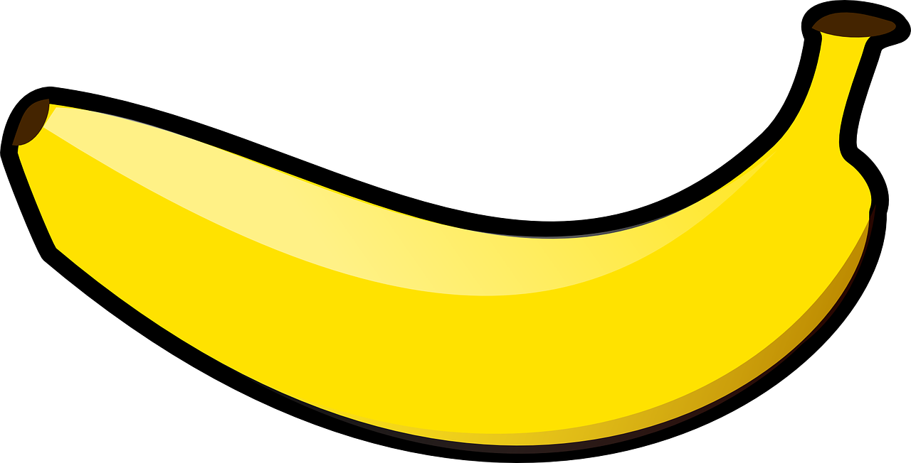
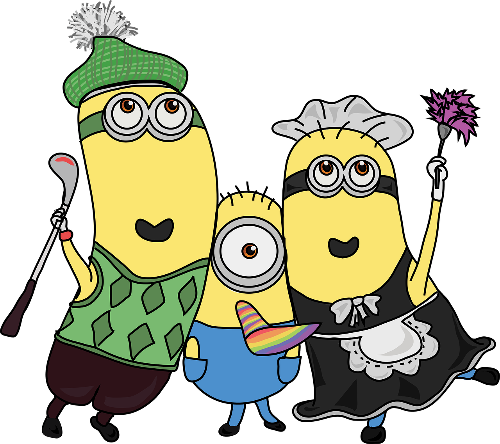

# 5000DOSA 블로그
<!doctype html>
 <html lang="ko">
  <head>
    <h1>체크박스를 클릭해보세요</h1>
    <meta charset="utf-8">
    <title>CSS</title>
    
  </head>
  <body>
    <input type="checkbox">
    

  </body>
</html>

    

<html lang="ko">
  <head>
    <h1>미니언즈는 바나나를 좋아합니다</h1>
    <meta charset="utf-8">
    <title>CSS</title>
    
  </head>
  <body>
    
    

      
      
    

  </body>
</html>

    

    

      <h1>막대기를 클릭해보세요</h1>
      

        
        
        
      

    

    
  
      

      

        
        
        
      

    

    

      

      

        <svg viewBox="0 0 130 108" xmlns="http://www.w3.org/2000/svg" version="1.1">
          <rect width="120" height="20" rx="4" >
            <animate dur="0.3s" begin="toggle.begin" attributeName="width" values="120; 136" fill="freeze" calcMode="spline" keySplines="0.2 0 0.2 1;" />
            <animateTransform dur="0.3s" begin="toggle.begin" attributeName="transform" type="rotate" values="0 10 20;45 10 20" fill="freeze" calcMode="spline" keySplines="0.2 0 0.2 1;" />
            <animate dur="0.3s" begin="reverseToggle.begin" attributeName="width" values="136; 120" fill="freeze" calcMode="spline" keySplines="0.2 0 0.2 1;"/>
            <animateTransform dur="0.3s" begin="reverseToggle.begin" attributeName="transform" type="rotate" values="45 10 20; 0 10 20" fill="freeze" calcMode="spline" keySplines="0.2 0 0.2 1;"/>
          </rect>
          <rect y="44" width="120" height="20" rx="4" style="transform-origin: 50%" >
            <animateTransform dur="0.3s" begin="toggle.begin" attributeName="transform" type="scale" values="1; 0.1" fill="freeze" calcMode="spline" keySplines="0.2 0 0.2 1;"/>
            <animateTransform dur="0.3s" begin="reverseToggle.begin" attributeName="transform" type="scale" values="0.1; 1" fill="freeze" calcMode="spline" keySplines="0.2 0 0.2 1;"/>
          </rect>
          <rect y="88" width="120" height="20" rx="4">
            <animate dur="0.3s" begin="toggle.begin" attributeName="width" values="120; 136" fill="freeze" />
            <animateTransform dur="0.3s" begin="toggle.begin" attributeName="transform" type="rotate" values="0 10 88; -45 10 88" fill="freeze" calcMode="spline" keySplines="0.2 0 0.2 1;"/>
            <animate dur="0.3s" begin="reverseToggle.begin" attributeName="width" values="136; 120" fill="freeze" calcMode="spline" keySplines="0.2 0 0.2 1;"/>
            <animateTransform dur="0.3s" begin="reverseToggle.begin" attributeName="transform" type="rotate" values="-45 10 88; 0 10 88" fill="freeze" calcMode="spline" keySplines="0.2 0 0.2 1;" />
          </rect>
  
          <rect width="120" height="108" fill-opacity="0">
            <animate dur="0.01s" attributeName="width" values="120; 0" fill="freeze" id="toggle" begin="click" />
            <animate dur="0.01s" attributeName="width" values="0; 120" fill="freeze" begin="reverseToggle.end" />
          </rect>
          <rect width="0" height="108" fill-opacity="0">
            <animate dur="0.001s" attributeName="width" values="120; 0" fill="freeze" id="reverseToggle" begin="click" />
            <animate dur="0.001s" attributeName="width" values="0; 120" begin="toggle.end" fill="freeze"  />
          </rect>
        </svg>
      

    

    

      
      

        
        
        
      

    

    

      
      

        
        
        
      

    

  

 